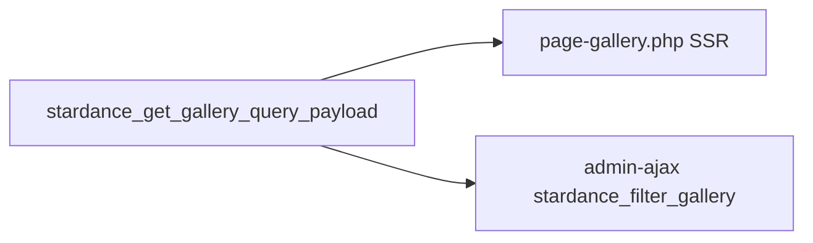

# Gallery: overview and data model

How the **Gallery** page is backed in WordPress (custom post type and taxonomies), how server-side queries build HTML, and how that HTML is shared between the initial page load and AJAX.

---

## What ships on first load

The Gallery is a **WordPress page** using the template **`page-gallery.php`**. On every full request, PHP:

1. Loads filter options (year and type terms).
2. Runs a paginated query (`posts_per_page` **12**, `paged` **1**).
3. Prints the resulting item markup inside `[data-gallery-grid]`.

Scripts then take over for **filter changes** and **Show more**. See [gallery-filters-ajax-show-more.md](./gallery-filters-ajax-show-more.md).

---

## CMS model

| Piece | Role |
|--------|------|
| **Post type `gallery_item`** | One post per gallery asset; **featured image** is required for grid output (`stardance_render_gallery_item` returns early without a thumbnail). |
| **Taxonomy `gallery_year`** | Hierarchical admin terms (e.g. `2026`); drives the **Year** filter. |
| **Taxonomy `gallery_type`** | Hierarchical admin terms (e.g. competition vs event); drives the **Type** filter. |

**Implementation:** `stardance_register_post_types()` and `stardance_register_taxonomies()` in `stardance-theme/functions.php`.

**Important:** `gallery_item` is registered with **`publicly_queryable` => false** and **no front rewrite**. There are no public single URLs for gallery posts in this theme; the **Gallery page** and **WP_Query** are the public surface.

---

## Query building

**`stardance_get_gallery_query_args( $filters )`** (`functions.php`) merges defaults and builds a `tax_query` when `gallery_year` or `gallery_type` is set to something other than empty string or the literal `'all'`. Multiple tax clauses use **`relation` => `AND`**.

Base query shape:

- `post_type` => `gallery_item`
- `post_status` => `publish`
- `posts_per_page` => from filters (integer; gallery page uses **12**)
- `paged` => from filters
- `orderby` => `menu_order` ASC, then `date` DESC

---

## Filter options (taxonomy terms)

**`stardance_get_gallery_filter_options()`** returns:

- `years` — `get_terms()` on `gallery_year`, `hide_empty` true, ordered by **name DESC**
- `types` — `get_terms()` on `gallery_type`, `hide_empty` true, ordered by **name ASC**

The template loops these arrays to render tab buttons on the Gallery page (`page-gallery.php`).

---

## Markup payload (SSR and AJAX reuse)

**`stardance_get_gallery_query_payload( $filters )`** runs `WP_Query` with the merged filters, renders each matching post via **`stardance_render_gallery_item( $post_id, $delay, $animate )`**, then returns:

| Key | Meaning |
|-----|--------|
| `markup` | HTML string (trimmed). May be empty when appending past the last page. |
| `has_more` | `max_num_pages > current_page` |
| `max_pages` | `$query->max_num_pages` |
| `found_posts` | `$query->found_posts` |

**Empty state:** If there are no posts **and** `paged <= 1`, the payload includes a `
` message. For `paged > 1` with no rows (edge case), no empty block is emitted so “load more” does not flash a full-page empty message.

**Animation:** The third argument **`$animate`** controls whether each item gets `fade-in fade-in-delay-N` classes. Initial SSR uses the default **`animate` => true** (staggered entrance). AJAX responses use **`animate` => false** so filtered or appended items do not inherit stagger classes incorrectly.

---

## Per-item HTML

**`stardance_render_gallery_item()`** in `stardance-theme/inc/components.php`:

- Outer element: **`<a class="sd-gallery-page__item" href="…full image URL…">`**
- Inner **``** uses the **`large`** registered size for the featured image (grid performance).
- **`href`** uses the **`full`** size URL — that is what the lightbox loads for the full-screen view.
- **`loading="lazy"`** on the grid image.
- Optional overlay caption built from title + year + type labels.
- **Schema.org** microdata: `itemprop="associatedMedia"`, `itemscope`, `ImageObject` on the anchor; grid wrapper uses `ImageGallery` in `page-gallery.php`.

---

## Data flow diagram

---

## Related paths

| File | Purpose |
|------|--------|
| `stardance-theme/page-gallery.php` | Gallery page template and filter markup |
| `stardance-theme/functions.php` | CPT, taxonomies, `stardance_get_gallery_*`, AJAX handler |
| `stardance-theme/inc/components.php` | `stardance_render_gallery_item()` |
| `stardance-theme/functions.php` | `stardance_get_gallery_seed_items()` — starter content for development / seed only |
